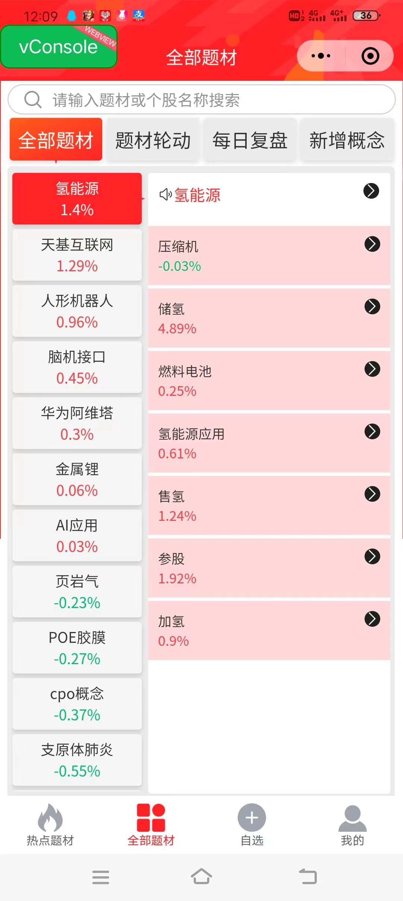
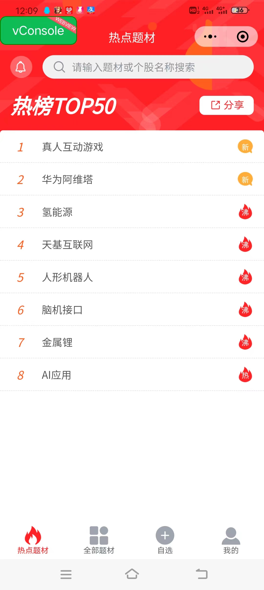
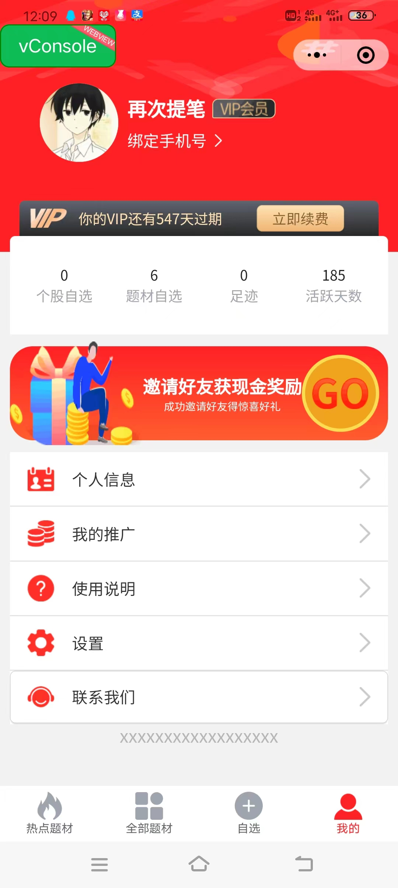

# s题材笔记

蓝湖地址：https://lanhuapp.com/link/#/invite?sid=lX00NbLU

股市数据接口地址：http://api.mairui.club/

竞品：微信小程序【股多多题材库】

#### 分支介绍：

dev：用于功能开发

release：用于发布体验版

main：发完体验后将代码合并到 main 主分支

#### git 使用规范

feat：新增功能（feature）

fix：修复补丁（bug）

docs：修订文档，如 Readme, Change Log, Contribute 等

refactor：代码重构，未新增任何功能和修复任何 bug

style： 仅调整空格、格式缩进等（不改变代码逻辑的变动）

perf：优化相关，改善性能和体验的修改

test：测试用例的增加/修改

chore：非 src 和 test 的修改

merge：合并分支或冲突等

revert： 回滚到上一个版本

build：改变构建流程，新增依赖库、工具等（例如 webpack、maven 修改）

ci：自动化流程配置修改

# UI界面

------

)

